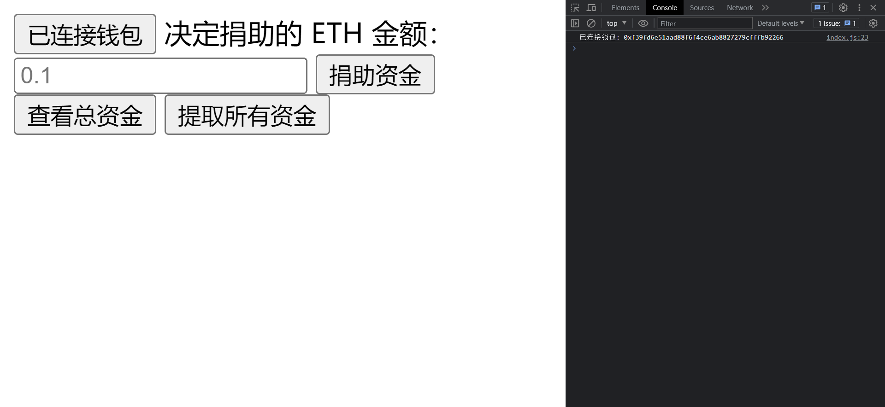

# 筹款应用

这是一个基于以太坊的筹款项目。用户可以通过智能合约向项目捐款，并且只合约的所有者才能提取资金。

## 前提条件

- [Node.js](https://nodejs.org/zh-cn/download)
- [Git](https://git-scm.com/book/zh/v2/%E8%B5%B7%E6%AD%A5-%E5%AE%89%E8%A3%85-Git)
- [VSCode Live Server 插件](https://marketplace.visualstudio.com/items?itemName=ritwickdey.LiveServer)

## 如何开始

该项目在本地环境下运行，且基于 Foundry-FundMe 项目，因此需要先运行 Foundry-FundMe 项目，再运行 HTML-FundMe 项目。

具体步骤如下：

### 1. 运行 Foundry-FundMe 项目

```shell
# 导入 Foundry-FundMe 项目
git clone https://github.com/eiyen/Foundry-FundMe.git
# 进入该项目
code Foundry-FundMe
# 启动本地网络 Anvil
anvil
```

然后新建一个终端，输入以下命令：

```shell
# 在 Avil 网络部署 FundMe 合约
make deploy-anvil
```

至此，成功在 Anvil 网络中部署 FundMe 合约。

### 2. 运行 HTML-FundMe 项目

点击 VSCode 右下角的 Live Server 即可启动项目。

交互项目时，需要按下 `F12` 打开 Developer Tools，在 Console 中查看交互的输出结果。

## 效果演示

主页面：


连接钱包：

